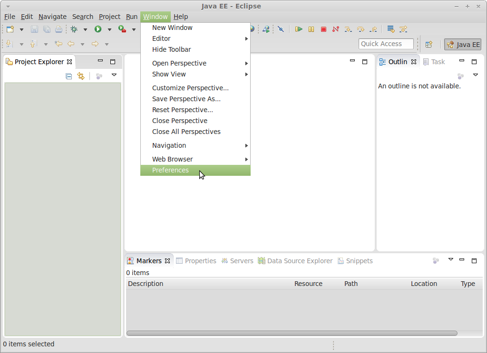
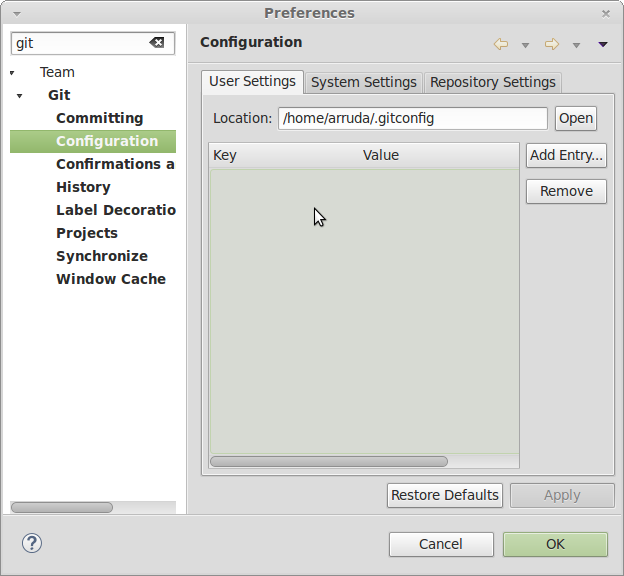

# Configuração

## Criando Uma Conta no Github

Para criar uma conta, devemos acessar o endereço: https://github.com/.

Em seguida devemos preencher o formulario de cadastro e clicar em **Sign Up for Github**, conforme a imagem a seguir:

## Configurando o Git

Devemos agora configurar algumas coisas no git (através do plugin **EGit** no **Eclipse**).

### Preferências do Eclipse

Para acessar essas configuraçãos, clique no menu **Window->Preferences**:

### Configurações do Git

Na janela de preferências podemos escrever **"git"** no campo de busca (canto superior esquerdo) e em seguida selecionar a opção **Team->Git->Configuration** no painel esquerdo:

#### Adicionando Informações do Usuário

A principio para poder ter um ambiente funcional devemos adicionar duas configurações ao git:

* nome do usuario
* email do usuario

Para isso clique no botão **[add Entry...]** e coloque os dados a seguir, trocando o campo **value** pelos seus dados:

Isso informa ao Git qual o nome do usuario que vai fazer os commits quando você estiver logado na sua máquina:

Agora devemos informar o email do usuario, novamente clique no botão **[add Entry...]** e coloque os dados a seguir, trocando o campo **value** pelos seus dados:

## Próximo Tópico
Próximo Tópico: [Prática](../pratica/README.md)