# Prática

## Criando um Repositório no Github

Uma vez feito o login no Github, podemos criar um novo repositório de um projeto facilmente clicando em **[+ New Repository]**, localizado no canto inferior direito da tela, conforme a imagem abaixo:

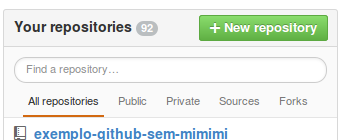

Na tela seguinte colocamos os dados do novo repositório:

* nome
* descrição

E selecionamos a *checkbox* **initialize this repository with a README**. O que essa opção faz é que ao invés de ter um repositório vazio, ele criará um repositório já com um commit responsavel por criar um arquivo README com os dados de nome e descrição do projeto. Isso é algo que agiliza um pouco as coisas. Em seguida clicamos em **[Create Repository]**

A imagem abaixo é um exemplo de como pode ser preenchido esses campos:

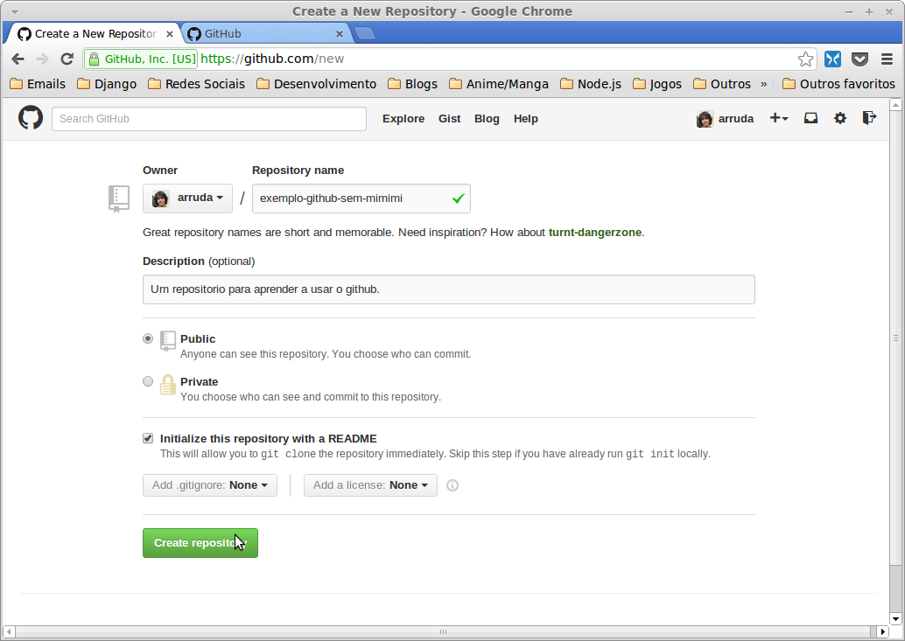

## Clone do Repositório

Agora que já temos um repositório **remoto** (o repositório que acabou de ser criado no Github), podemos fazer um **clone** dele localmente.

Mas antes disso precisamos selecionar algumas janelas no Eclipse para realizar essas operações.

### Habilitando Janelas do Egit

Selecionamos no menu **Window->Show view->Other...**:

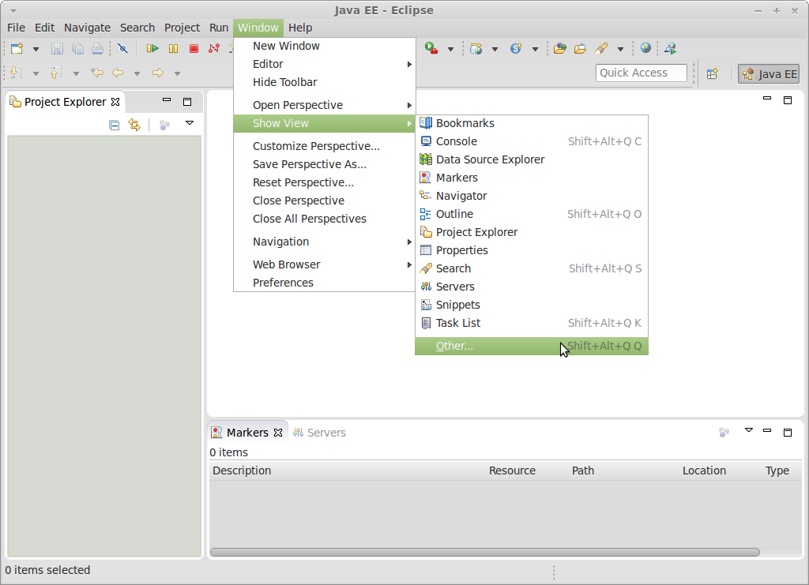

Na janela que abrir digitamos **git** para filtrar as janelas disponiveis, e escolhemos as opções:

* Git Repositories
* Git Staging

### Usando Egit Para Clonar o Repositório

Na nova janela, recém incluida, **Git Repositories** clicamos na opção **Clone a Git Repository**.

Para o próximo passo, precisamos pegar o endereço do repositório git que criamos no Github, para isso, vá na pagina do novo repositório e copie o endereço de **HTTPS** (não usar o SSH, já que para utiliza-lo seria necessário outras configurações mais avançadas). A figura abaixo mostra onde se encontra esse link:

Agora colocamos no primeiro campo (**URI**) colocamos o link do repositório git que criamos no Github.

Automaticamente os outros campos irão ser preenchidos, faltando apenas os campos relativos a **Autenticação**.

No campo **user** coloque seu usuário do Github, e no campo **password** coloque sua senha, e clique em **[Next]**.

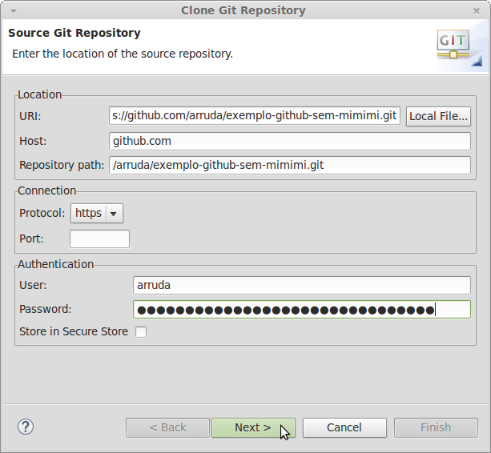

Na próxima janela temos a opção de quais branches iremos trazer/baixar neste clone, como temos apenas nosso branch padrão (o branch **master**) não precisamos mudar nada nesta tela.

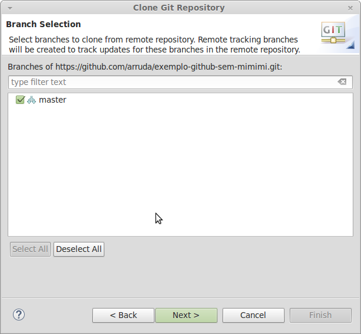

Na próxima tela temos uma série de opções, mas podemos ignorar todas elas, e apenas considerar uma: **Directory**.
Nesta opção selecionamos onde vai ser clonado o repositório localmente. Se não quiser, pode deixar neste local por padrão, isso fica a gosto de cada um. Por fim clicamos em **[Finish]**.

Feito isso, podemos ver que agora temos localmente um clone do repositório git que criamos no github.

### Criando um Projeto no Eclipse a Partir do Repositório Local

O que temos agora não é ainda um projeto no eclipse, portanto não podemos utilizar as facilidades da IDE para trabalhar nesse repositorio recém clonado. Isso é: Temos o repositório na nossa máquina mas ele ainda não foi importado como um projeto do Eclipse.

Para isso vamos clicar com o botão direito no repositório e selecionar a opção **Import Projects...**:

Na próxima janela selecionamos a opção **Import as General Project** e clicamos em **[Next]**:

Na janela seguinte, se quisermos, podemos trocar o nome do projeto. Por fim clicamos em **[Finish]**

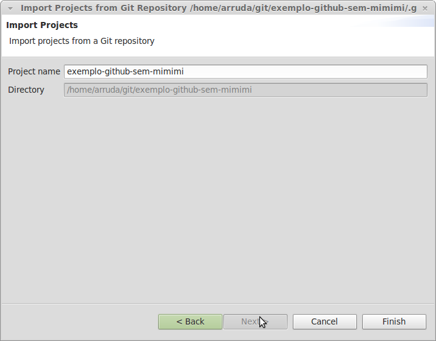

Agora tornamos nosso repositório em um projeto do Eclipse:

### Fazendo o Git Ignorar Arquivos Desnecessários

Se formos para a aba de **Git Staging** e selecionarmos o projeto recém criado, veremos que ele mostra um arquivo **.project** numa área denominada **Unstaged Changes**.

Esse arquivo foi criado pelo Eclipse, ele que tem os dados, que o Eclipse entende, sobre o projeto que criamos a pouco.

Neste caso, ele aparece na área **Unstaged Changes** pois é um novo arquivo, e o Git está nos informando que ele é uma nova alteração que ainda não foi marcada (**Git add**) para ser versionada.

Entretanto, não iremos versionar esse arquivo, isso por que é um pouco sem sentido commitar esse arquivo, já que não necessáriamente iremos usar o Eclipse sempre neste projeto. Ou então se um colega que decida colaborar com o trabalho não usar a IDE Eclipse não faz sentido este arquivo que é expecifico para o local de trabalho de cada um ser versionado. Em algumas situações inclusive isso pode gerar problemas, já que se em uma máquina o arquivo **.project** tem alguma informação sobre o caminho para aquele projeto, podemos ter outra maquina que não se utilize o mesmo caminho. Isso faria com que o **.project** de uma maquina atrapalhasse o de outra.

Portanto devemos dizer para o Git ignorar esse arquivo.

Para fazer com que o Git pare de verificar se um determinado arquivo foi modificado clicamos neste com o botão direito, e selecionamos a opção **Ignore**.

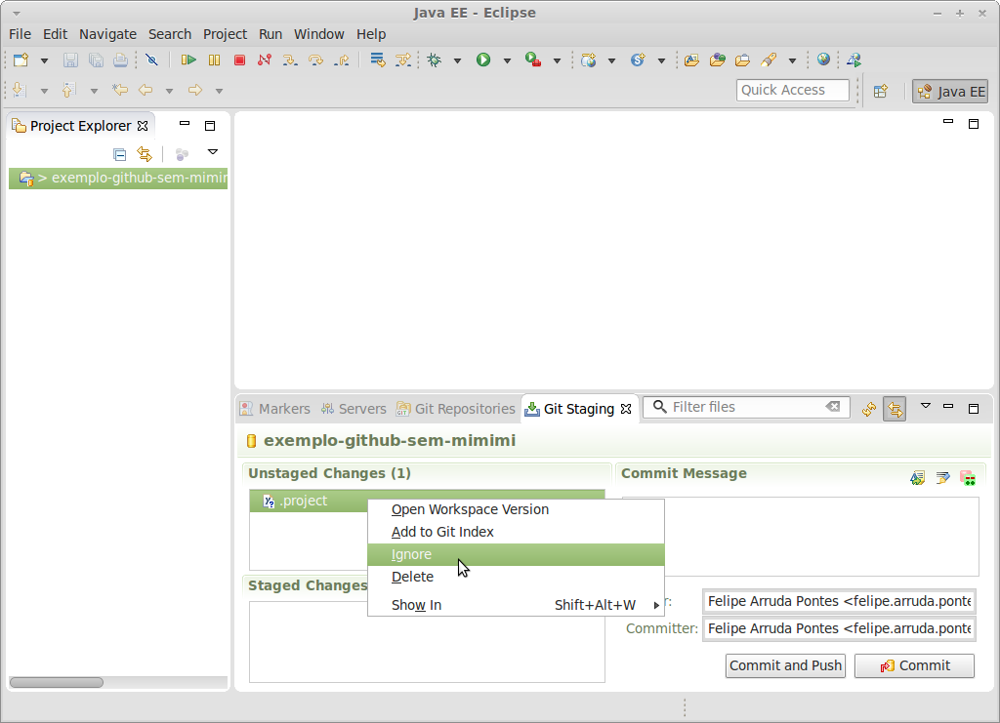

Feito isso veremos que o arquivo .project sumirá da janela **Unstaged Changes**, e agora temos outro arquivo aparecendo: **.gitignore**.

Esse é o arquivo que contém as informações que dizem ao Git para ignorar determinados arquivos que escolhermos.
Para que em qualquer lugar os mesmos arquivos sejam ignorados, devemos versionar esse arquivo e portanto coloca-lo em um commit.

## Commits Locais

A primeira coisa que devemos fazer para versionar (commitar) uma alteração em nosso repositório local é marcar quais arquivos, dentre os que sofreram alguma alteração, devem ser commitados.

Portanto para adcionar um arquivo a um commit (o equivalente ao comando **Git Add**), devemos clicar e arrastar o arquivo da janela de **Unstaged Changes** para a janela de **Stages Changes**:

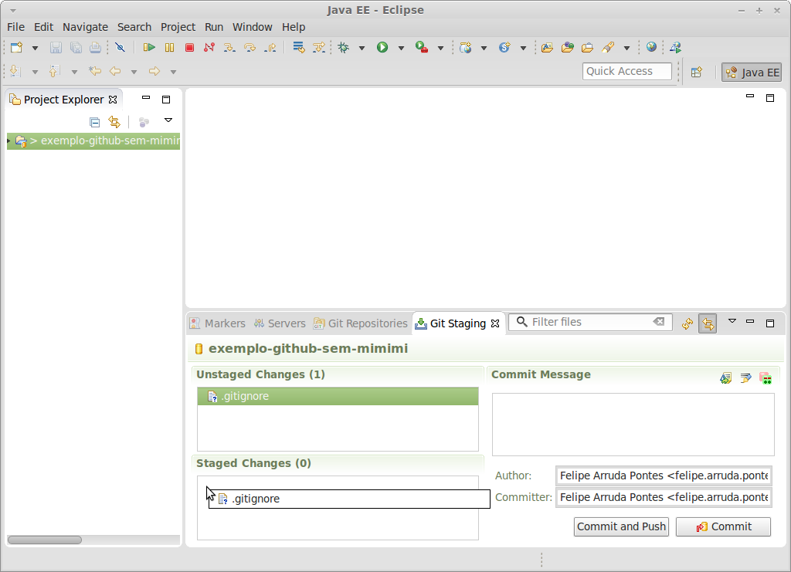

Uma vez feito isso para todos os arquivos que queiramos commitar, devemos escrever uma mensagem de commit que em poucas palavras descreva a alteração sendo realizada. Escrevemos essa mensagem no campo **Commit Message**, e uma vez concluído clicamos em **[Commit]**:

Se quisermos ver o histórico dos commits, para ter uma noção da timeline de nossas alterações, podemos clicar com o botão direito no repositorio e selecionar a opção **Show in->History**.

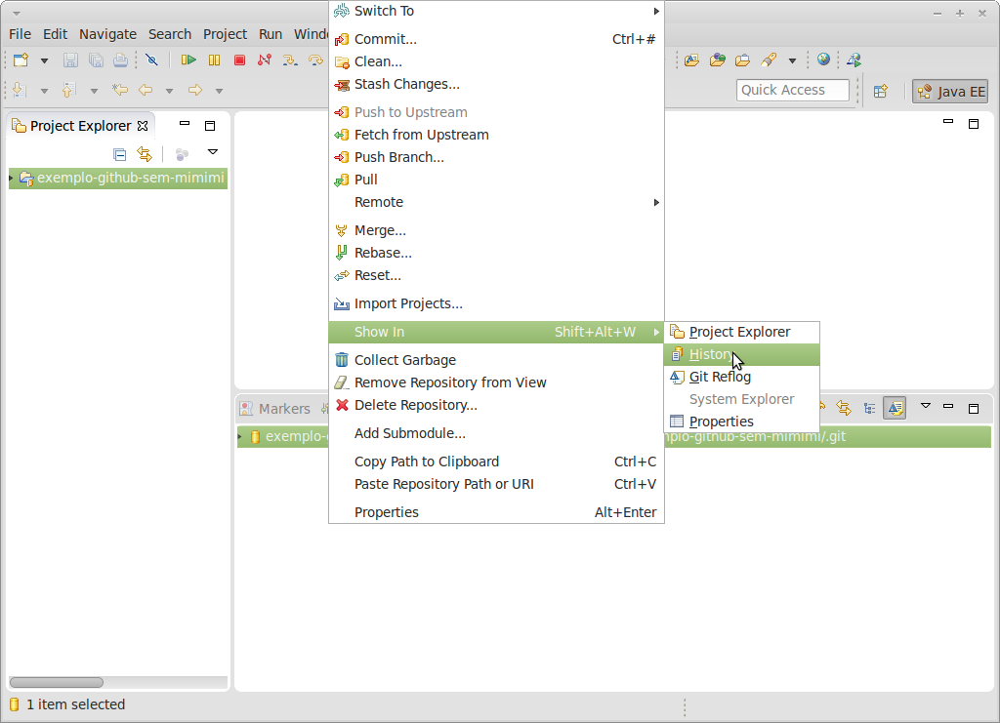

Isso mostrará a timeline do nosso repositório, isso é, nossa arvore de commits, onde os commits mais recentes ficam no topo.

## Push

Agora que fizemos o commit localmente precisamos enviar essa alteração para nosso repositório remoto (aquele do Github) para atualiza-lo com nossas novas alterações.

Para isso vamos fazer um push. Assim clicamos com o botão direito no repositório em questão e selecionamos a opção: **push to upstream**:

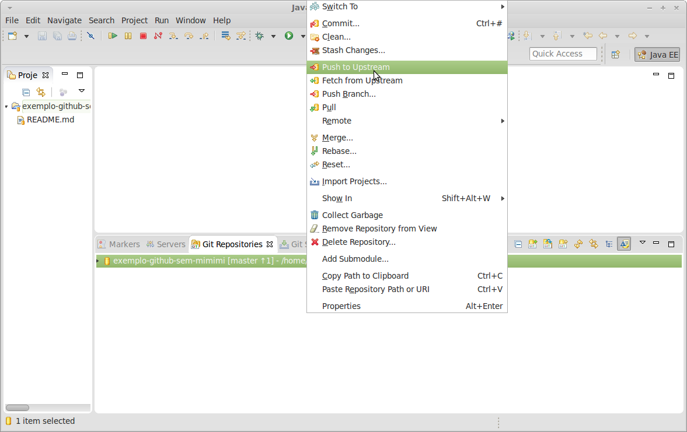

Neste ponto provavelmente será pedido o usuario e a senha do Github, uma vez informado é exibido uma janela informando o que foi enviado:

## Pull

Antes de começarmos a ver a parte do **Pull** vamos navegar para a janela do projeto no Github, mais especificamente vamos para o arquivo **README.md** de nosso repositório, e clicamos no botão no formato de um **lápis**, para habilitar a edição deste arquivo no próprio browser:

Uma vez nesta tela alteramos o arquivo README.md com alguma coisa, ex:

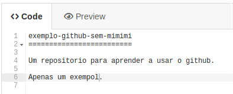

Para commitar essas alterações pelo Github devemos escrever a mensagem de commit, e clicar em **[Commit Changes]**:

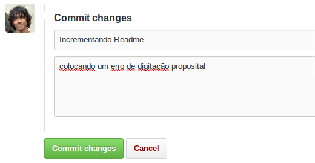

Com isso nosso repositório local está agora desatualizado em relação ao remoto (Github).

Portanto devemos fazer um **pull** das novas alterações para o nosso repositório local.

Para tal, clicamos com o botão direito no nosso repositório e em seguida selecionamos a opção **pull**:

Isso abrirá uma tela informando quais as alterações foram pegas (**pull**) do Github:

## Comparar Alterações (Diff)
Vamos agora fazer mais uma alteração local no **README.md**, trocando outros detalhes, ex:

Agora, na aba do **Git staging**, damos dois cliques no arquivo **README.md** (dentro da janela de **unstaged changes**).

Isso abrirá uma janela que mostra as alterações que foram feitas (**esquerda**) em comparação com o que tinha antes (**direita**) localmente:

Agora que conferimos que a alteração é aquilo mesmo que queriamos, podemos commitar essa alteração:

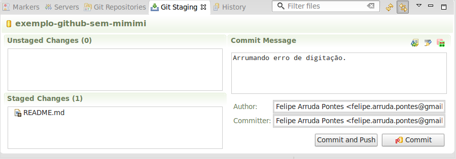

## Contribuindo

Existem diversas maneiras de se contribuir em um repositório no Github, porém, por conta da carga horária do curso, veremos apenas a mais simples de todas.

Neste caso iremos incluir diretamente um outro usuário como **Colaborador**, assim este terá direito de enviar diretamente seus commits (**push**) para seu repositório.

Para isso, vá no seu repositório do Github, e selecione a opção **Settings**, que fica no menu da direita:
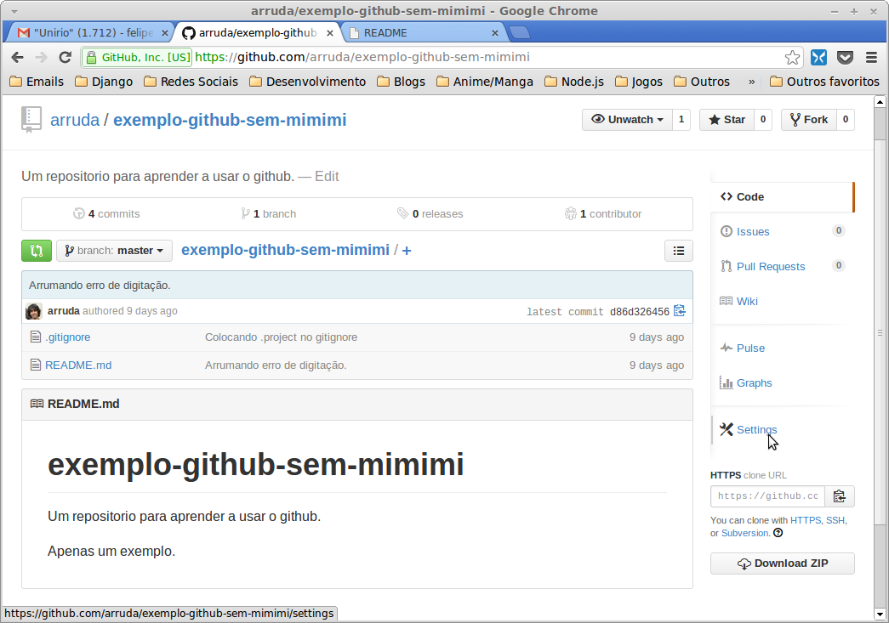

Em seguida selecione a opção **Collaborators** no menu da esquerda:
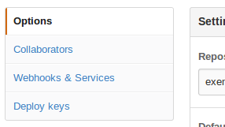

Coloque o username do colaborador e clique em **[Add Collaborator]**:
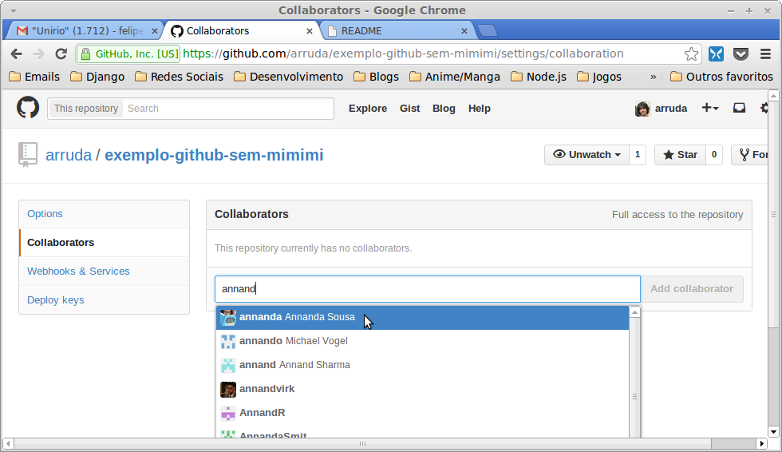

Por fim, você terá a lista dos seus colaboradores neste repositório:

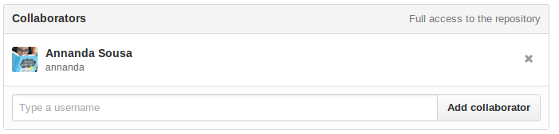

